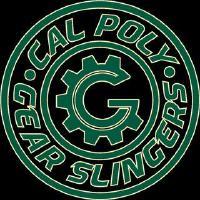

<!-- PROJECT SHIELDS -->
<!--
*** I'm using markdown "reference style" links for readability.
*** Reference links are enclosed in brackets [ ] instead of parentheses ( ).
*** See the bottom of this document for the declaration of the reference variables
*** for contributors-url, forks-url, etc. This is an optional, concise syntax you may use.
*** https://www.markdownguide.org/basic-syntax/#reference-style-links
-->
<div align="left">

[![Contributors][contributors-shield]][contributors-url]
[![Forks][forks-shield]][forks-url]
[![Stargazers][stars-shield]][stars-url]

</div>

<a href="https://github.com/CalPolyVEX/2025-2026">
  
</a>

<div align="left">
  <h1><em><a href="https://github.com/CalPolyVEX/2025-2026">~2025-2026</a></em></h1>
</div>

<!-- ABOUT THE PROJECT -->

Gear Slingers robot code for Push Back (2024-2025 Season).

### Built With

[![C++][C++-shield]][C++-url]
[![GNU Make][GNU-Make-shield]][GNU-Make-url]

<!-- GETTING STARTED -->

## Getting Started

### Prerequisites

Before attempting to build this project, make sure you have [PROS](https://pros.cs.purdue.edu) installed on your machine.

### Installation

To get a local copy of the project up and running on your machine, follow these simple steps:

1. Clone the project repository

   ```sh
   git clone https://github.com/CalPolyVEX/2025-2026.git
   cd 2025-2026/
   ```

2. Build the package

   ```sh
   pros make
   ```

3. Run the package node

   ```sh
   pros upload
   pros run
   ```

<!-- PROJECT FILE STRUCTURE -->

## Project Structure

```sh
2025-2026/
├── include/                       - project header files
├── src/                           - project source files
│   └── main.cpp                   - Entry point, main function
├── Makefile                       - Makefile build script
├── LICENSE                        - project license
└── README.md                      - you are here
```

## Robot Wiring

### Smart Ports

| Port | Description   | Port | Description |
|------|---------------|------|-------------|
| 1    | Left Wheels   | 11   |             |
| 2    |               | 12   |             |
| 3    | Claw Motor    | 13   |             |
| 4    |               | 14   |             |
| 5    | Vision Sensor | 15   |             |
| 6    |               | 16   |             |
| 7    |               | 17   |             |
| 8    | Arm Motor     | 18   |             |
| 9    |               | 19   |             |
| 10   | Right Wheels  | 20   |             |

Port 21: Radio

### Analog Digital Input (ADI) Ports

| Port | Description  | Port | Description |
|------|--------------|------|-------------|
| A    | Left Bumper  | E    |             |
| B    | Right Bumper | F    |             |
| C    |              | G    |             |
| D    | Arm Limit    | H    |             |

## License

The source code for this project is distributed under the terms of the MIT License, as we firmly believe that collaborating on free and open-source software fosters innovations that mutually and equitably beneficial to both collaborators and users alike. See [`LICENSE`](./LICENSE) for details and more information.

<!-- MARKDOWN LINKS & IMAGES -->
<!-- https://www.markdownguide.org/basic-syntax/#reference-style-links -->

[contributors-shield]: https://img.shields.io/github/contributors/Kaweees/ros2.svg?style=for-the-badge
[contributors-url]: https://github.com/CalPolyVEX/2025-2026/graphs/contributors
[forks-shield]: https://img.shields.io/github/forks/CalPolyVEX/2025-2026.svg?style=for-the-badge
[forks-url]: https://github.com/CalPolyVEX/2025-2026/network/members
[stars-shield]: https://img.shields.io/github/stars/CalPolyVEX/2025-2026.svg?style=for-the-badge
[stars-url]: https://github.com/CalPolyVEX/2025-2026/stargazers

<!-- MARKDOWN SHIELD BAGDES & LINKS -->
<!-- https://github.com/Ileriayo/markdown-badges -->
[C++-shield]: https://img.shields.io/badge/C++-%23008080.svg?style=for-the-badge&logo=c%2B%2B&logoColor=004482&labelColor=222222&color=004482
[C++-url]: https://isocpp.org/
[GNU-Make-shield]: https://img.shields.io/badge/GNU%20Make-%23008080.svg?style=for-the-badge&logo=gnu&logoColor=A42E2B&labelColor=222222&color=A42E2B
[GNU-Make-url]: https://www.gnu.org/software/make/
